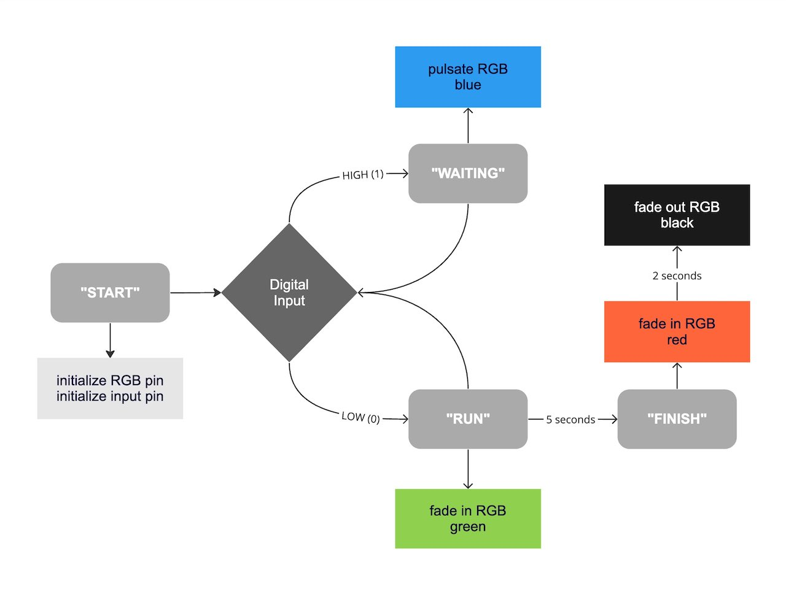

## Assignment #3 Documentation Template  
  
Each assignment/project we complete in this class should be documented in your own 
GitHub repository.  I recommend that you organize your project files into 
separate folders and document it using a `README.md` file written in 
text-based *Markdown* format (.md)  
  
Please review the [GitHub Markdown Tutorial](https://docs.github.com/en/get-started/writing-on-github/getting-started-with-writing-and-formatting-on-github/basic-writing-and-formatting-syntax) 
to learn how to on how to use this format. This page is the recommended structure for your 
documentation and you can check its [raw version](https://github.com/pa-nik/SP25-IXD-256/edit/main/assignment03/README.md) 
to see the Markdown code.  
  
Think of this documentation as project explanation and a resource for 
yourself, as well as someone new who could be coming across your project online. 

### Introduction

Provide a description of your initial project idea and include images of 
the concept sketches that you created in Part 1 of this assignment.  

### State Diagram

Explain the interactive behaviors of the prototype you created and include a 
state diagram (flowchart) to represent it.  For example, below is an example 
state diagram included in the assignment description:  

  

### Hardware

List all the separate hardware components used in your project and briefly 
explain what they do. To create a list with markdown syntax, 
use `-`, `*`, or `+` characters with each line of text:  
* item 1  
* item 2   
* etc.  

Include at least one image showing your hardware wiring. You can draw the wiring 
connections by hand, use a graphical program, or take close-up photo(s).  

### Firmware   

Upload your MicroPython code and highlight important code snippet(s) that make 
your prototype work.  Most likely you should explain the inputs/outputs used 
in your code and how they affect the behavior of the prototype.

To include code snippets, you can use the code block markdown:

``` Python  
  if input_pin.value():  # read digital input
    led_pin.off()        # turn off LED light
  else:
    led_pin.on()         # turn on LED light
```

### Physical Components   

Explain what products, materials or components you used for the project. 
If you fabricated your own project components, include some details on 
how you made them.

### Project outcome  

Summarize the results of your project implementation and include at least 
1 photo of the finished prototype.  
  
  
  
Finally, include a short video walkthrough of your project showing all of 
its functioning aspects (voice over is optional but could be helpful).  
  
<video width="600" controls>
  <source src="./a03_video.mp4" type="video/mp4">
  Your browser does not support the video tag.
</video>
  
Note that GitHub has a small size limit for uploading files via browswer (25Mb max), 
so you may choose to use a link to YouTube, Google Drive, or another external site.
